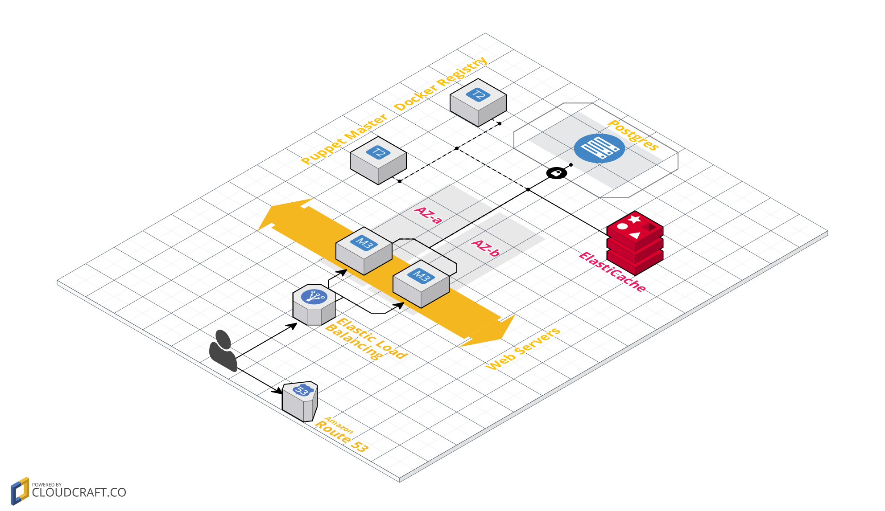

Solution
********

Vagrant
=======

* ``./Vagrantfile``
    * Build docker image of guestbook
    * Run ``bootstrap.sh`` which will instal puppet agent, and puppet modules
    * Run puppet provisioning
    * Run ``postbootstrap.sh`` which will run ``rake db:migrate`` and reboots
* ``./manifests/default.pp``
    * Install/configure  redis, postgres
    * Run guestbook container with defined ``REDIS_HOST`` and ``DATABASE_URL``
      parameters.

Use ``vagrant up --provision`` to run/provision guestbook application. When
done demo web should be reachable at: http://192.168.30.30/

P.S: in case of nic related errors, please upgrade vagrant to latest version.

...............................................................................

AWS
===

`Link
<https://cloudcraft.co/view/b5c412cc-f194-48cf-b9b7-7cefe9a487a3?key=2TfWsgkpcNzvRdGAt06gMg>`_

Posgres server[s] assumed located in different data center connected to AWS VPC
with VPN in HA mode.

For all ELB/EC2 security groups, by default all inbound ports are filtered and
allowed only ones required, such as port 80 from outside to ELB, port 80 from
ELB to web applications, etc.

ELB
###

Both web application instance will be added in ELB with health check
configured.

Route 53
########

New DNS record creating alias for ELB.

Web Applications
################

Guestbook application by itself will be built as docker container. This will
provide easier way to create and package whole application in commit stage
tests of CI/CD which will be added later to the application. We will be able to
test application after commits, and if it passes build container and push to
registry for further testing (Acceptance, Manual) or deploying in production.
CI/CD should version containers so that we should be always aware of which
version is being tested, is deployed or is release candidate.

For HA will be running 2 EC2 instances in two AZ both attached to the same ELB.

``Cloud-init`` script installs puppet agent and sets ``facter`` role attribute
to string such as ``guestbook``.

For this role puppet will install docker daemon, and runs ``guestbook``
container, pulling from registry.

Adding new instance for web application would require create new EC2 instance
with the same ``cloud-init`` script. Puppet will do the whole
configuration/provisioning. When done we can than add new instance to ELB to
place in production.

Puppet Server
#############

Dedicated EC2 instance running open source puppet master. Using ``Code
Manager`` to deploy forge or custom module on puppet master. Using ``hiera``
for configuration values separating from puppet modules.

Docker Registry
###############

Separate EC2 instance, provisioned by puppet master to run docker registry as
container mounting data volume separately.

ElastiCache
###########

For web application, new ElastiCache redis  will be running with Multi AZ and
failover configured. In case of failure, application should be able to switch
to new master node promoted automatically by ElastiCache.
